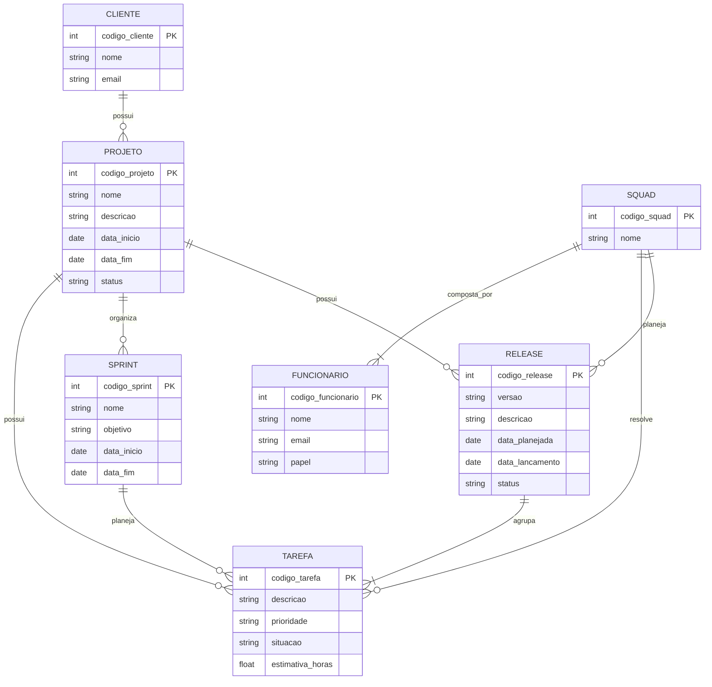

# Tarefa 02 - MER e Projeto de Banco de Dados Relacional

### Q1. O modelo de dados entidade-relacionamento foi desenvolvido para facilitar o projeto de banco de dados, permitindo especificação de um esquema que representa a estrutura lógica geral de um banco de dados. Descreva os três elementos básicos de um Modelo Entidade Relacionamento (MER).

Os três elementos básicos de um **Modelo Entidade-Relacionamento (MER)** são **entidades, atributos e relacionamentos**.

**Entidades:**

As entidades representam objetos ou elementos do mundo real que possuem importância para o sistema e sobre os quais é necessário armazenar informações.

**Atributos:**

Os atributos representam as características ou propriedades de uma entidade.

**Relacionamentos:**

Os relacionamentos representam as associações existentes entre as entidades. Os relacionamentos também possuem **cardinalidades**, que indicam quantas ocorrências de uma entidade podem estar relacionadas a outra.

### Q2. Pesquise sobre as várias notações possíveis para Diagramas ER e cite alguns exemplos de notações diferentes para o mesmo conceito (ex.: cardinalidade, entidade subordinada, etc.).

Existem diferentes formas de representar um **Diagrama Entidade-Relacionamento (ER)**. As principais notações utilizadas são **Chen**, **Crow's Foot (Pé de Galinha)** e **UML**.
Embora utilizem símbolos diferentes, todas elas podem representar os mesmos conceitos, como entidades, atributos, relacionamentos e cardinalidades.

1. Notação de Chen

A **notação de Chen** é uma das formas tradicionais de representação de modelos entidade-relacionamento.
Nessa notação:

- **Retângulos** representam entidades;
- **Losangos** representam relacionamentos;
- **Elipses** representam atributos;
- As cardinalidades são indicadas próximas aos relacionamentos.

2. Notação Crow's Foot

Na notação **Crow's Foot**, as entidades normalmente são representadas por caixas contendo seus atributos.
A cardinalidade é representada graficamente nas extremidades dos relacionamentos.

3. Notação UML

A UML (Unified Modeling Language) também pode ser utilizada para representar estruturas de dados.
As entidades são representadas como classes, contendo seus atributos, e os relacionamentos são representados por linhas entre as classes.

As multiplicidades podem ser representadas como:
1 — exatamente um; 0..1 — zero ou um; * — muitos; 1..* — um ou muitos.

### Q3. Construa um Diagrama ER para projetar a base de dados de uma empresa de desenvolvimento de software com outras empresas como clientes. A base de dados não deve conter redundância de dados. O modelo ER deve ser representado com um diagrama usando Mermaid.js. O modelo deve apresentar, ao menos, entidades, relacionamentos, atributos, identificadores e restrições de cardinalidade. O modelo deve ser feito no nível conceitual, sem incluir chaves estrangeiras. a) A empresa presta serviços de desenvolvimento de software para outras empresas (clientes). Cada cliente é identificado por um código, um nome e um e-mail de contato. b) Os funcionários da empresa trabalham em squads (equipes). Cada funcionário é identificado por um código, um nome e um e-mail, e possui um papel na equipe: desenvolvedor, testador, líder técnico, supervisor ou gerente de produto. c) Cada squad é formada por vários funcionários e resolve tarefas (issues). Uma tarefa tem código, descrição, prioridade, situação e uma estimativa em horas. As tarefas pertencem a projetos de um cliente. d) O trabalho é organizado em iterações (sprints). Uma squad planeja releases para seus clientes; uma release agrupa um conjunto de tarefas e passa por testes de validação.

